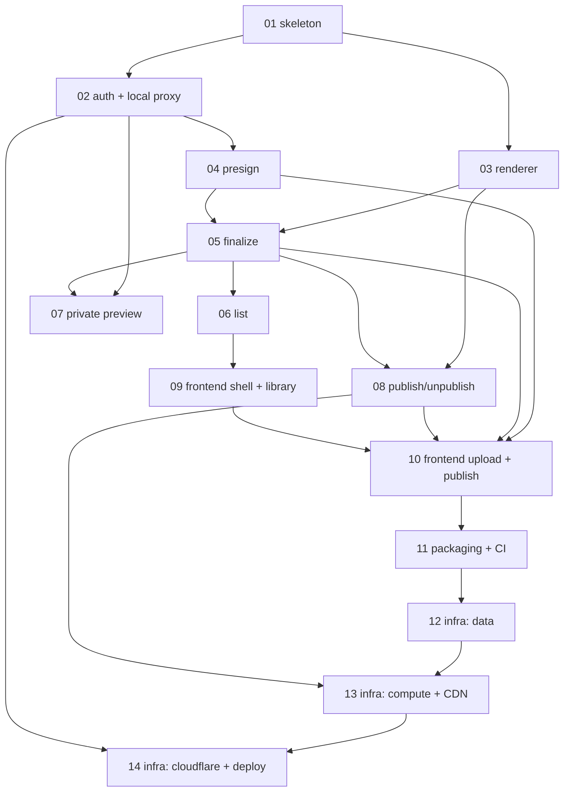

# Issues — share

Vertical-slice (tracer-bullet) breakdown of [`PRD.md`](../PRD.md). Each slice cuts through every relevant layer end-to-end and is independently verifiable. Sequencing strategy: **local-vertical-first** — build and verify the entire product locally (moto + a local Cloudflare-Access-compatible JWT proxy), then stand up real AWS/Cloudflare last. All 43 PRD user stories are covered.

These issues are ready for AFK agents (label: `ready-for-dev`). Grab any issue whose blockers are done.

## Slices

| # | Title | Blocked by | ~LOC |
| --- | --- | --- | --- |
| [01](01-walking-skeleton.md) | Walking skeleton: app + host gate + error mapper + middleware + Mangum | — | 470 |
| [02](02-access-verifier-local-proxy.md) | Cloudflare Access JWT verifier + local Access proxy | 01 | 415 |
| [03](03-content-renderer.md) | Content renderer: HTML passthrough + Markdown (wenmode), golden tests | 01 | 110 |
| [04](04-presign-upload.md) | Presign vertical: `POST /api/uploads/presign` | 02 | 360 |
| [05](05-finalize-upload.md) | Finalize vertical: `POST /api/uploads/finalize` | 03, 04 | 385 |
| [06](06-list-content.md) | List vertical: `GET /api/content` (cursor pagination) | 05 | 140 |
| [07](07-private-preview.md) | Private preview: `GET/HEAD /u/{sha}` (security headers) | 02, 05 | 160 |
| [08](08-publish-unpublish.md) | Publish/Unpublish (idempotent, invalidation behind a fake) | 03, 05 | 330 |
| [09](09-frontend-skeleton-library.md) | Frontend skeleton + static serving + dev proxy + library | 06 | 460 |
| [10](10-frontend-upload-publish.md) | Frontend upload + publish/unpublish interactions | 04, 05, 08, 09 | 400 |
| [11](11-packaging-build-ci.md) | Packaging, build pipeline, and CI (vendored zip) | 10 | 250 |
| [12](12-infra-data.md) | Pulumi data infra: DynamoDB + two S3 buckets | 11 | 350 |
| [13](13-infra-compute-cdn.md) | Pulumi compute + CDN: Lambda + APIGW + CloudFront/OAC + ACM | 12, 08 | 480 |
| [14](14-infra-cloudflare-deploy.md) | Pulumi Cloudflare + production deploy wiring | 13, 02 | 250 |

## Dependency graph

First locally-demoable product milestone: **slice 09** (browse a real authenticated library at `share.localhost`). First publish-to-public-URL milestone: **slice 10**. First real deploy: **slice 14**.

## Prefactoring (folded into slice 01)

Monorepo scaffold (backend `uv` `src/share/`, Vite frontend, Pulumi-TS infra, root Makefile) · shared `classify_host` registry · `error_response` envelope + all ~15 error codes as `ShareError` subclasses · settings/config DI · frozen `renderer.render(raw, source_type, *, title) -> bytes` signature · single atomic two-item DynamoDB write helper · module-level caching JWKS provider.

## Resolved decisions (from throwaway worktree spikes)

- **`wenmode` is real** — PyPI v0.7.0 (lepture), pure-Python, zero transitive deps, `requires-python >=3.10`. Unsafe config: `HTMLRenderer(escape=False, sanitize_urls=False, sanitize_attrs=False)` + `presets.github`. Beta → pin + golden tests.
- **`cryptography` is a native dep** (via `PyJWT[crypto]` for RS256 verify) — vendor the arm64 manylinux wheel via `uv --python-platform`. No Docker, no Lambda layers (yet).
- **DynamoDB two-item write** — single `TransactWriteItems` via the **low-level** `boto3.client("dynamodb")` (the resource `Table` double-serializes and raises `unhashable type: dict` under moto); resource `Table` for get/query.
- **`created_at` = millisecond/monotonic** so same-second uploads sort deterministically in the list sort key.
- **Email allowlist** = plain lowercased `str` compare (no `pydantic[email]`).

## Open items applied as defaults (override if you disagree)

These implementation-detail forks were settled with sensible defaults rather than blocking the breakdown; flagged here for visibility:

- `sanitize_attrs=False` (keeps `onclick=` etc.) — faithful to the PRD's "preserve unsafe/raw behaviors".
- Presigned-POST policy enforcement can't be exercised by in-process moto; tests simulate with `put_object`. An optional gated real-S3 / `moto_server` integration check could be added if desired.
- Per-host Access AUD originates in Cloudflare/Pulumi and is mirrored into backend `AccessConfig` via config (slice 14).
- SPA-at-`/` may need habit-tracker's trailing-slash `307` shim (decided in slice 09).

## Deployment status

**LIVE (deployed 2026-06-27).** All 14 slices implemented, reviewed, and merged to `main`; the `prod` Pulumi stack is applied to AWS account `123456789012` + Cloudflare. 57 resources, all ACM certs `ISSUED`, CloudFront `Deployed`.

- Hosts: `share.example.com` + `private.usercontent.example` → **302 Cloudflare Access challenge** (gated); `public.usercontent.example` → CloudFront/OAC (never hits Lambda); raw API Gateway invoke → **403** (Cloudflare-IP resource policy). Boundary checks (`scripts/boundary_checks.sh`) pass for the two automatable checks; #1 (in-browser Access login) and #4 (needs a published SHA) are manual.
- Key identifiers: stack `prod`, secrets provider `awskms://alias/share-pulumi`, REST API `xxxxxxxxxx` (stage `v1`), CloudFront `EXXXXXXXXXXXXX`, buckets `share-private-123456789012` / `share-public-123456789012` (account-suffixed to dodge S3's global namespace).
- Config overrides applied at deploy: `share:cloudflareTeamDomain=myteam` (the slice-14 default `example` was wrong — issuer must be `https://myteam.cloudflareaccess.com`), and the two account-suffixed bucket names.
- **Two bugs surfaced only at `pulumi up`** (the mock-based config tests can't validate against the real AWS API), both fixed on `main`: (1) CloudFront `ResponseHeadersPolicy` must declare recognized security headers in `securityHeadersConfig`, not `customHeadersConfig`; (2) the ACM certs had no Cloudflare DNS-validation records or issuance gate, so they sat `PENDING_VALIDATION` — added `certValidation.ts`.

## Operator prerequisites (deploy bootstrap)

Status of the human/external prerequisites for the infra slices. **Slices 01–11 need none of this** — they run on moto + the local Access proxy. Required only before slices 12–14 `pulumi up`:

- **Domains/zones** — `example.com` and `usercontent.example` both active on Cloudflare (same account). `usercontent.example` registrar is Namecheap, nameservers repointed to Cloudflare.
- **Cloudflare Access** — Zero Trust org exists: team `myteam` → issuer `https://myteam.cloudflareaccess.com` (the value slice 02's verifier checks). Login method already configured (reused from habits). The two per-host Access apps + audiences are created by Pulumi (slice 14).
- **Cloudflare API token** `share-pulumi` — scopes: Account · *Access: Apps and Policies* = Edit, Account · *Access: Organizations, IdP, and Groups* = Read, Zone · *DNS* = Edit, Zone · *Zone* = Read (all zones). Backup in 1Password; also dropped as a local plaintext file **outside this repo** (operator-supplied path, `chmod 600`). Seed at slice 14 without echoing it: `pulumi config set --secret cloudflare:apiToken "$(tr -d '[:space:]' < <token-file>)"` — KMS-encrypts it into stack config, after which the plaintext file can be deleted.
- **AWS account** `123456789012`, region `us-east-1`.
- **Pulumi state backend** — self-managed S3: `s3://share-pulumi-state-123456789012?region=us-east-1` (private, versioned, AES256). `pulumi login` done; Pulumi CLI v3.248.0.
- **Deploy identity** — `ShareDeployRole` (ARN `arn:aws:iam::123456789012:role/ShareDeployRole`), assumed by `deploy-iam-user` via `[profile share-deploy]` in `~/.aws/config`. Policies: AWS-managed `PowerUserAccess` + inline `ShareDeployIam` (IAM role/policy management + `PassRole` to lambda/apigateway, scoped to `role/share-*` & `policy/share-*`). **Run every `pulumi`/deploy command with `AWS_PROFILE=share-deploy`** — root is no longer needed (it was used once to bootstrap the state bucket + this role). **Infra must name any IAM role/policy it creates with a `share-` prefix** (e.g. the Lambda execution role) or the scoped IAM perms won't apply.
- **Stack secrets provider (decided)** — `awskms://alias/share-pulumi`. The KMS key + alias are created out-of-band at the first `pulumi stack init` (slice 12) as `share-deploy` (PowerUser covers KMS). Pulumi then decrypts config secrets automatically via the role's KMS access — no passphrase to manage.
- **Deploy authorization (granted 2026-06-27)** — the operator authorized the agent to run `pulumi preview`/`pulumi up` as `AWS_PROFILE=share-deploy` without per-deploy approval. Practice: always `pulumi preview` first and report the diff; explicitly flag any destructive replace/delete before applying. (Cloudflare deploys at slice 14 still require the API token to be seeded into stack config first — see the token bullet above.)
