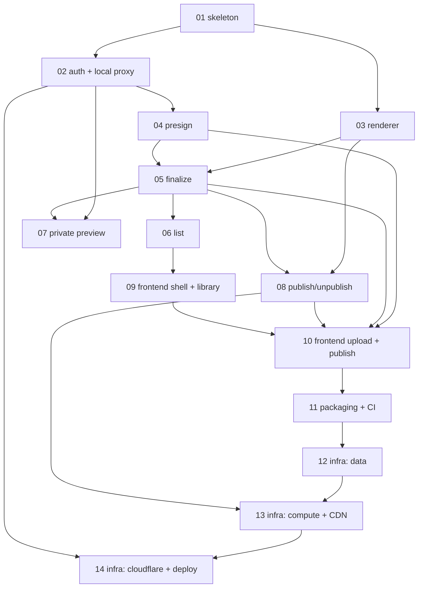

# Issues — share

Vertical-slice (tracer-bullet) breakdown of [`PRD.md`](../PRD.md). Each slice cuts through every relevant layer end-to-end and is independently verifiable. Sequencing strategy: **local-vertical-first** — build and verify the entire product locally (moto + a local Cloudflare-Access-compatible JWT proxy), then stand up real AWS/Cloudflare last. All 43 PRD user stories are covered.

These issues are ready for AFK agents (label: `ready-for-dev`). Grab any issue whose blockers are done.

## Slices

| # | Title | Blocked by | ~LOC |
| --- | --- | --- | --- |
| [01](01-walking-skeleton.md) | Walking skeleton: app + host gate + error mapper + middleware + Mangum | — | 470 |
| [02](02-access-verifier-local-proxy.md) | Cloudflare Access JWT verifier + local Access proxy | 01 | 415 |
| [03](03-content-renderer.md) | Content renderer: HTML passthrough + Markdown (wenmode), golden tests | 01 | 110 |
| [04](04-presign-upload.md) | Presign vertical: `POST /api/uploads/presign` | 02 | 360 |
| [05](05-finalize-upload.md) | Finalize vertical: `POST /api/uploads/finalize` | 03, 04 | 385 |
| [06](06-list-content.md) | List vertical: `GET /api/content` (cursor pagination) | 05 | 140 |
| [07](07-private-preview.md) | Private preview: `GET/HEAD /u/{sha}` (security headers) | 02, 05 | 160 |
| [08](08-publish-unpublish.md) | Publish/Unpublish (idempotent, invalidation behind a fake) | 03, 05 | 330 |
| [09](09-frontend-skeleton-library.md) | Frontend skeleton + static serving + dev proxy + library | 06 | 460 |
| [10](10-frontend-upload-publish.md) | Frontend upload + publish/unpublish interactions | 04, 05, 08, 09 | 400 |
| [11](11-packaging-build-ci.md) | Packaging, build pipeline, and CI (vendored zip) | 10 | 250 |
| [12](12-infra-data.md) | Pulumi data infra: DynamoDB + two S3 buckets | 11 | 350 |
| [13](13-infra-compute-cdn.md) | Pulumi compute + CDN: Lambda + APIGW + CloudFront/OAC + ACM | 12, 08 | 480 |
| [14](14-infra-cloudflare-deploy.md) | Pulumi Cloudflare + production deploy wiring | 13, 02 | 250 |

## Dependency graph

First locally-demoable product milestone: **slice 09** (browse a real authenticated library at `share.localhost`). First publish-to-public-URL milestone: **slice 10**. First real deploy: **slice 14**.

## Prefactoring (folded into slice 01)

Monorepo scaffold (backend `uv` `src/share/`, Vite frontend, Pulumi-TS infra, root Makefile) · shared `classify_host` registry · `error_response` envelope + all ~15 error codes as `ShareError` subclasses · settings/config DI · frozen `renderer.render(raw, source_type, *, title) -> bytes` signature · single atomic two-item DynamoDB write helper · module-level caching JWKS provider.

## Resolved decisions (from throwaway worktree spikes)

- **`wenmode` is real** — PyPI v0.7.0 (lepture), pure-Python, zero transitive deps, `requires-python >=3.10`. Unsafe config: `HTMLRenderer(escape=False, sanitize_urls=False, sanitize_attrs=False)` + `presets.github`. Beta → pin + golden tests.
- **`cryptography` is a native dep** (via `PyJWT[crypto]` for RS256 verify) — vendor the arm64 manylinux wheel via `uv --python-platform`. No Docker, no Lambda layers (yet).
- **DynamoDB two-item write** — single `TransactWriteItems` via the **low-level** `boto3.client("dynamodb")` (the resource `Table` double-serializes and raises `unhashable type: dict` under moto); resource `Table` for get/query.
- **`created_at` = millisecond/monotonic** so same-second uploads sort deterministically in the list sort key.
- **Email allowlist** = plain lowercased `str` compare (no `pydantic[email]`).

## Open items applied as defaults (override if you disagree)

These implementation-detail forks were settled with sensible defaults rather than blocking the breakdown; flagged here for visibility:

- `sanitize_attrs=False` (keeps `onclick=` etc.) — faithful to the PRD's "preserve unsafe/raw behaviors".
- Presigned-POST policy enforcement can't be exercised by in-process moto; tests simulate with `put_object`. An optional gated real-S3 / `moto_server` integration check could be added if desired.
- Per-host Access AUD originates in Cloudflare/Pulumi and is mirrored into backend `AccessConfig` via config (slice 14).
- SPA-at-`/` may need a [sibling project](https://github.com/rbharvs/habit-tracker)'s trailing-slash `307` shim (decided in slice 09).

## Deploy

Deployment is manual and gated: `mise run deploy` runs the tests + build, then an interactive `pulumi up` whose yes/no prompt is the gate. Slices 01–11 need no cloud at all (they run on moto + the local Access proxy); only slices 12–14 touch real AWS/Cloudflare. The `prod` stack provisions a single-table DynamoDB, two S3 buckets, an arm64 Lambda + REST API Gateway (Cloudflare-IP-restricted resource policy), an OAC-only CloudFront distribution for the public host, DNS-validated ACM certs, and the Cloudflare DNS + Zero Trust Access apps. After an apply, `scripts/boundary_checks.sh` exercises the host boundaries (Access-gated dashboard/private hosts, public host served only by the CDN, raw API Gateway invoke rejected).

Stack configuration lives in `infra/Pulumi.prod.yaml` (gitignored — it holds account/zone ids and the KMS-encrypted Cloudflare token); copy `infra/Pulumi.prod.yaml.example` to start. The hosts, owner email, bucket names, and team slug are all config-driven, so the same code deploys to any account/domain.

**Two bugs surfaced only at real `pulumi up`** (the mock-based config tests can't validate against the live AWS API), both since fixed: (1) CloudFront `ResponseHeadersPolicy` must declare recognized security headers in `securityHeadersConfig`, not `customHeadersConfig`; (2) DNS-validated ACM certs need their validation records written to the DNS zone and an issuance gate, or they sit `PENDING_VALIDATION` — see `infra/certValidation.ts`.

## Deploy prerequisites

Provisioned out-of-band before the first `pulumi up`:

- **Domains/zones** — the dashboard apex and the content apex both active on Cloudflare (same account).
- **Cloudflare Access** — a Zero Trust org (its team slug becomes the JWT issuer `https://<slug>.cloudflareaccess.com` that the slice-02 verifier checks). Pulumi creates the two per-host Access apps + audiences.
- **Cloudflare API token** — scopes: Account · *Access: Apps and Policies* = Edit, Account · *Access: Organizations, IdP, and Groups* = Read, Zone · *DNS* = Edit, Zone · *Zone* = Read. Seed it as a stack secret: `pulumi config set --secret share:cloudflareApiToken <token>` (KMS-encrypted into stack config).
- **AWS account** + region (`us-east-1`; CloudFront/ACM require it).
- **Pulumi state backend** — a self-managed S3 bucket (private, versioned, encrypted), then `pulumi login`.
- **Deploy identity** — a non-root IAM role with `PowerUserAccess` + an inline policy for IAM role/policy management and `PassRole` to lambda/apigateway, scoped to `role/share-*` & `policy/share-*`. Run deploy commands under that profile. **Infra must name any IAM role/policy with a `share-` prefix** or the scoped permissions won't apply.
- **Stack secrets provider** — `awskms://alias/<key-alias>`; create the KMS key + alias at first `pulumi stack init` so Pulumi decrypts config secrets with no passphrase to manage.
